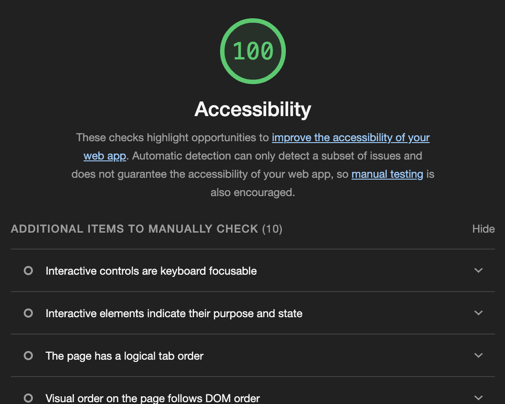

# LAB - 02

## About-me

This website asks the user five simple questions about me and displays my short biography. The purpose is to give the user a simple and quick way to get to know me

### Author: Brendan McMullen

### Links and Resources

### Lighthouse Accessibility Report Score

### Reflections and Comments

This is working well and I understand the code. However I am getting two errors in the console: 

favicon.ico:1 GET http://127.0.0.1:5500/favicon.ico 404 (Not Found)

and 

127.0.0.1/:1 Uncaught (in promise) Error: A listener indicated an asynchronous response by returning true, but the message channel closed before a response was received

These don't seem to be causing problems but I don't know what is causing this.