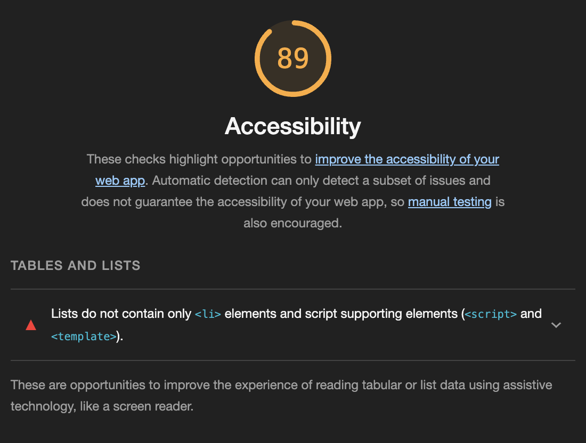

# LAB - 03

## About-me

This website asks the user five simple questions about me and displays my short biography. It also asks the user to guess my age and one of my top ten favorite movies. The purpose is to give the user a simple and quick way to get to know me. It also includes a list of my top ten favorite movies and my work and education experience.

### Author: Brendan McMullen

### Links and Resources

I used chatGPT to figureout how to break an outer loop from a nested loop.

### Lighthouse Accessibility Report Score

### Reflections and Comments

This is working well and I understand the code. However I am getting two errors in the console: 

favicon.ico:1 GET http://127.0.0.1:5500/favicon.ico 404 (Not Found)

and 

127.0.0.1/:1 Uncaught (in promise) Error: A listener indicated an asynchronous response by returning true, but the message channel closed before a response was received

These don't seem to be causing problems but I don't know what is causing this.

Driver: Brandon Mizutani
Navigator: Brendan McMullen
